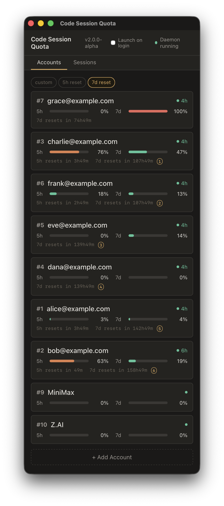
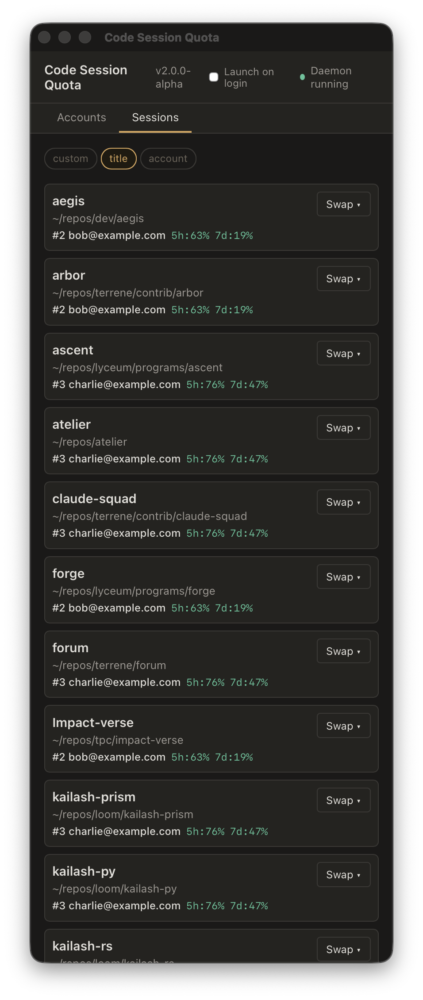

# Code Session Quota (csq)

Multi-account session manager for Claude Code. Monitor quota across accounts, auto-refresh OAuth tokens, swap sessions in-place, and manage everything from a desktop dashboard or CLI.


## What it does

- **Desktop dashboard** -- see all accounts, quota bars, token health, and reset times at a glance. Sort by custom order, 5h reset, or 7d reset. Ranked badges show which accounts reset soonest.
- **Live session management** -- every running Claude Code instance appears in the Sessions tab with its account, quota, working directory, and session age. Sort by title or account.
- **Background daemon** -- auto-refreshes OAuth tokens and polls Anthropic for usage data. No manual token management after initial login.
- **In-place account swap** -- `! csq swap N` from inside a rate-limited CC session switches credentials without restarting the conversation.
- **Per-terminal isolation** -- each terminal gets its own `CLAUDE_CONFIG_DIR` and keychain slot. Swapping one terminal doesn't affect others.
- **Shared history & memory** -- conversations, projects, and auto-memory are symlinked from `~/.claude`, so `/resume` works across all accounts.
- **Statusline** -- see `#6:Frank 5h:18% 7d:13%` in your terminal prompt at a glance.
- **System tray** -- tray icon with per-account quick-swap menu. Icon color reflects health (green/yellow/red).
- **Cross-platform** -- macOS, Linux, and Windows. Tested in CI on all three.

## Architecture

csq is a Rust workspace with three crates:

| Crate         | Purpose                                                        |
| ------------- | -------------------------------------------------------------- |
| `csq-core`    | OAuth, credentials, quota, daemon, session discovery, rotation |
| `csq-cli`     | CLI binary (`csq login`, `csq run`, `csq status`, `csq swap`)  |
| `csq-desktop` | Tauri 2.x desktop app with Svelte 5 frontend                   |

The desktop app runs an in-process daemon that handles token refresh, usage polling, and auto-rotation -- no separate daemon process needed.

## Install

### From source (recommended)

```bash
git clone https://github.com/terrene-foundation/csq.git
cd csq
cargo install --path csq-cli
```

### Desktop app

```bash
cd csq-desktop
npm install
npm run tauri build
```

The built app is in `csq-desktop/src-tauri/target/release/bundle/`.

### Shell installer (CLI only)

```bash
curl -sSL https://raw.githubusercontent.com/terrene-foundation/csq/main/install.sh | bash
```

## Quick start

### 1. Add accounts

```bash
csq login 1   # opens browser -- log in to account 1
csq login 2   # repeat for each account
csq login 3
```

### 2. Run sessions

```bash
csq run 1                    # start CC on account 1
csq run 3                    # another terminal on account 3
csq run 5 --resume           # resume most recent conversation
```

### 3. When rate limited

Inside the rate-limited CC session:

```
! csq swap 3                 # swap THIS terminal to account 3
```

The `!` prefix runs the command as a local shell op -- works even when CC is rate-limited.

### 4. Check status

```bash
csq status                   # show all accounts with quota and reset times
```

## Desktop app

The desktop app provides a dashboard for managing accounts and sessions.

### Accounts tab



- **Quota bars** -- 5h and 7d usage with color coding (green/yellow/red)
- **Token health** -- badges show healthy, expiring, expired, or missing
- **Reset times** -- countdown to next quota reset with ranked badges
- **Sort modes** -- custom order, 5h reset, or 7d reset
- **Rank badges** -- numbered badges (1, 2, 3...) show which accounts with remaining quota reset soonest
- **Re-auth button** -- appears on expired or errored accounts
- **Inline rename** -- double-click any account label to rename it

### Sessions tab



- **Live discovery** -- every running `claude` process appears automatically
- **Account labels** -- shows which account each session is using (reflects renames instantly)
- **Quota at a glance** -- 5h and 7d usage per session
- **Sort modes** -- custom order, by title, or by account
- **In-place swap** -- click "Swap" to change any session's account
- **Stale detection** -- "restart needed" badge when credentials were swapped after a session started
- **Session naming** -- double-click to give sessions custom names

### System tray

- Tray icon with per-account quick-swap menu
- Icon color reflects health: normal (green), warning (yellow), error (red)
- Tooltip shows account health summary
- "Launch on login" toggle for auto-start

## CLI reference

```bash
csq run N [-p provider]      # start CC on account N
csq run N --resume           # resume most recent conversation
csq status                   # show all accounts with quota
csq swap N                   # swap THIS terminal to account N
csq login N                  # add/refresh account N (opens browser)
csq statusline               # compact status for shell prompt integration
csq daemon start             # start background daemon (auto-started by desktop app)
csq daemon stop              # stop background daemon
csq daemon status            # check daemon health
```

## Statusline

csq provides a statusline for shell prompt integration:

```
#6:Frank 5h:18% 7d:13%
```

Add to your shell config:

```bash
# .zshrc or .bashrc
export PROMPT='$(csq statusline 2>/dev/null) '$PROMPT
```

Or use the provided `statusline-quota.sh` hook with Claude Code's statusline configuration.

## How it works

### Daemon

The daemon runs as a background process (or in-process inside the desktop app) and handles:

- **Token refresh** -- checks every 5 minutes, refreshes tokens expiring within 2 hours
- **Usage polling** -- polls Anthropic's `/api/oauth/usage` endpoint for each account
- **Credential fanout** -- distributes refreshed tokens to all terminals using that account
- **IPC** -- Unix socket server for CLI commands and desktop app communication

### Account/terminal separation

Accounts and terminals are distinct entities:

- **Account** = an authenticated Anthropic identity with its own credentials and quota
- **Terminal** = a CC instance that borrows an account's credentials

Multiple terminals can use the same account. Quota data comes from Anthropic's API (polled by the daemon), not from individual terminals.

### Identity derivation

Each config directory has a `.csq-account` marker file that tracks which account it's using. This marker (not the directory name) is the source of truth for account identity -- directory numbers are slot identifiers that can diverge after swaps.

### Credential safety

- Atomic writes for all credential files (temp + rename)
- File permissions set to `0600` on Unix
- Subscription metadata preserved during credential copies
- Keychain integration on macOS via `security-framework`
- Daemon IPC secured with Unix socket permissions + peer credential verification

## Files

| Path                                       | Purpose                                  |
| ------------------------------------------ | ---------------------------------------- |
| `~/.claude/accounts/credentials/N.json`    | OAuth credentials per account (mode 600) |
| `~/.claude/accounts/profiles.json`         | Account labels and email mappings        |
| `~/.claude/accounts/quota.json`            | Per-account quota from Anthropic API     |
| `~/.claude/accounts/config-N/`             | Per-terminal CC config directory         |
| `~/.claude/accounts/config-N/.csq-account` | Account identity marker                  |
| `~/.claude/accounts/csq.sock`              | Daemon Unix socket                       |
| `~/.claude/accounts/.csq-daemon.pid`       | Daemon PID file                          |

## Requirements

- **Rust 1.94+** (for building from source)
- **Node.js 22+** (for desktop app frontend)
- **Claude Code** installed and available as `claude` in PATH

### Platform support

| Platform | CLI  | Desktop | Daemon         | Session discovery     |
| -------- | ---- | ------- | -------------- | --------------------- |
| macOS    | Full | Full    | Full           | Full (ps + osascript) |
| Linux    | Full | Full    | Full           | Full (/proc)          |
| Windows  | Full | Full    | Planned (M8.6) | Full (PEB walking)    |

## Development

```bash
# Run tests (594 Rust tests)
cargo test --workspace

# Lint
cargo clippy --workspace --all-targets -- -D warnings

# Format
cargo fmt --all

# Desktop dev mode
cd csq-desktop && npm run tauri dev

# Svelte tests
cd csq-desktop && npx vitest run
```

## License

Apache 2.0 -- [Terrene Foundation](https://terrene.foundation)
